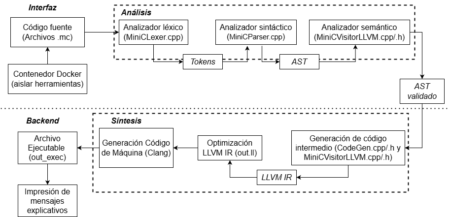
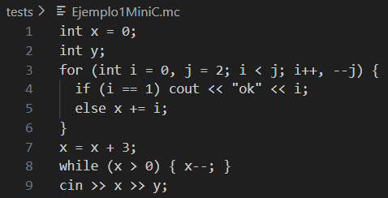
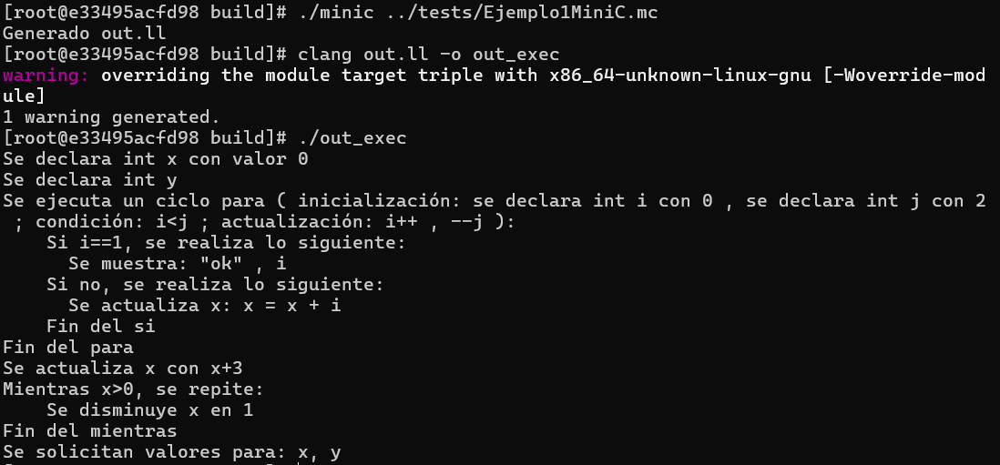

<div style="width: 100%; clear: both;">
<div style="float: left; width: 50%;">

</div>
<div style="float: right; width: 50%;">
<p style="margin: 0; padding-top: 22px; text-align:right;">1ACC0218-2520-1733 - Teoría de Compiladores </p>
<p style="margin: 0; text-align:right;">2025 · Compilador</p> 
<p style="margin: 0; text-align:right;">Prof: <b>Peter Jonathan Montalvo Garcia</b></p>
<p style="margin: 0; text-align:right; padding-button: 100px;">Integrante 1: <b>Mendoza Quispe Carlos Fabian  </b> - <a href="">U20231C416@upc.edu.pe</a></p>
<p style="margin: 0; text-align:right; padding-button: 100px;">Integrante 2: <b>Ibarra Cabrera Camila Adriana </b> - <a href="">U202317287@upc.edu.pe</a></p>
<p style="margin: 0; text-align:right; padding-button: 100px;">Integrante 3: <b>Rojas Sánchez Patricia Lucía del Rosario</b> - <a href="">U202310474@upc.edu.pe</a></p>
</div>
</div>
<div style="width:100%;">&nbsp;</div>
<center><h1>📙 Introducción</h1></center>
El pensamiento computacional es una habilidad crucial y fundamental para la programación moderna, ya que dota a los individuos de capacidades esenciales como el pensamiento crítico, la abstracción y el razonamiento algorítmico necesarias para la formulación de soluciones óptimas a problemas complejos, tanto dentro como fuera del ámbito informático; sin embargo, a pesar de su reconocida importancia, persisten serias dificultades en la enseñanza de la programación, inherentes a su complejidad técnica y a la falta de desarrollo de estas habilidades clave, donde la tendencia actual, amplificada por la influencia de la IA, prioriza la generación de código funcional complejo sobre el dominio de los fundamentos lógicos y algorítmicos, dejando a menudo a los programadores principiantes o inexpertos sin una base sólida; por esta razón, es imperativo reenfocar el aprendizaje de la programación desde sus etapas iniciales hacia la lógica y el pensamiento computacional, lo que no solo facilitará la comprensión clara y accesible de los fundamentos, sino que también proporcionará a los estudiantes una base robusta que les permitirá trascender las reglas específicas de un lenguaje para aplicar principios generales en diversos contextos, promoviendo una crucial adaptabilidad y preparándolos efectivamente para enfrentar nuevas tecnologías, herramientas y paradigmas de la programación.

<div style="width:100%;">&nbsp;</div>
<center><h1>💪 Problemática y motivación </h1></center>

El pensamiento computacional es una habilidad fundamental que todo ser humano debe desarrollar, ya que implica un conjunto de capacidades esenciales para la programación. La resolución de problemas, tanto computacionales como no computacionales, requiere de habilidades como el pensamiento crítico, el razonamiento compositivo, la coincidencia de patrones y el pensamiento procedimental, entre otras, para formular soluciones óptimas (Leticia y Norka, 2021). En particular, en la programación, es crucial que los estudiantes, y cualquier persona interesada en aprender sobre el tema, desarrollen el pensamiento algorítmico y la capacidad de abstracción. Estas habilidades son claves para resolver problemas de manera eficiente, estructurada y optimizada.

Pese a que, cada vez se reconoce con mayor vigor la importancia del pensamiento lógico computacional en la programación, todavía persisten dificultades inherentes a la complejidad técnica y a la falta de habilidades para la resolución de problemas. En el contexto actual, con la creciente influencia de la Inteligencia Artificial, conceptos como el pensamiento crítico, la abstracción y el diseño algorítmico están poco desarrollados (Vera et al., 2025). En cambio, se prioriza la generación de código funcional, que a menudo involucra operaciones matemáticas complejas y algoritmos avanzados, alejados del nivel de conocimiento del programador, especialmente si este es principiante o cuenta con poca experiencia en el tema.

Esta situación se ve agravada por la forma en que tradicionalmente se enseña la programación. Delgadillo y Ruiz (2021) encontraron que, aunque los estudiantes de Informática Administrativa reconocen la importancia de la programación para el desarrollo de sistemas de información y aplicaciones, la mayoría se siente neutral o inseguro al enfrentarse a la codificación, especialmente en sus primeros semestres. Esta inseguridad se debe, en parte, a que la enseñanza no siempre conecta la lógica algorítmica con contextos reales ni aprovecha herramientas que reduzcan la carga cognitiva inicial.
Además, Ayala Cadena y Aguilar Juárez (2023) destacan que los estudiantes de nuevo ingreso se enfrentan a un reto de alta complejidad: deben aprender definiciones técnicas abstractas, desarrollar algoritmos sin experiencia previa y comprender lenguajes de programación, todo ello sin el apoyo constante de un docente fuera del aula. En este escenario, el uso de software educativo especializado y agentes conversacionales puede actuar como puente, facilitando la autogestión del aprendizaje y reforzando la comprensión de la lógica subyacente.

Por ello, es fundamental hacer énfasis en la lógica y el pensamiento computacional desde las primeras etapas del aprendizaje de la programación. Este enfoque no solo ayudará a los estudiantes a comprender los fundamentos de la programación de manera clara y accesible, sino que también les proporcionará una base sólida sobre la cual podrán construir habilidades más avanzadas. Al dominar la lógica y pensamiento algorítmico, el estudiante no se verá limitado por las reglas específicas de un lenguaje, sino que podrá comprender cómo aplicar principios generales en diferentes contextos (Barragán, 2023). Este enfoque no solo facilita el aprendizaje de nuevos lenguajes, sino que también promueve una adaptabilidad duradera frente a las nuevas tecnologías, herramientas y paradigmas de programación.
Esta necesidad cobra especial relevancia en el contexto peruano, donde el Programa Nacional de Becas y Crédito Educativo (Pronabec) impulsa el acceso a carreras técnicas de alta demanda, como la programación. Tal como lo destacan los talentos becarios de Beca 18, la programación ofrece alta demanda laboral, rápida inserción profesional y flexibilidad modal, incluyendo trabajo remoto (Pronabec, 2022). Sin embargo, como afirma una becaria: “No importa dónde vives, ni tu género, ni tu edad, solo necesitas voluntad, disciplina y pasión” (Pronabec, 2022). Pero incluso con motivación, la barrera inicial de la sintaxis y la abstracción puede ser insuperable sin herramientas pedagógicas adecuadas.

Es en este escenario donde proponemos NumLang: un lenguaje de dominio específico (DSL) minimalista, diseñado expresamente para algoritmos numéricos y lógica básica, con una sintaxis cercana a la notación matemática natural. NumLang busca reducir la fricción cognitiva al eliminar la sobrecarga sintáctica innecesaria, permitiendo que los estudiantes se enfoquen en la lógica del algoritmo, no en la gramática del lenguaje. Además, como componente pedagógico, el compilador incluirá un módulo que traduce el código fuente a descripciones en lenguaje natural, reforzando la comprensión del flujo de ejecución

<div style="width:100%;">&nbsp;</div>
<center><h1>🎯 Objetivo </h1></center>

- **Objetivo general**

Diseñar e implementar un DSL minimalista que permite expresar operaciones matemáticas, condicionales y bucles con la menor sintaxis posible, y que sea capaz de compilar a código ejecutable eficiente mediante LLVM, con soporte adicional para generar descripciones en lenguaje natural con fines pedagógicos.

- **Objetivos específicos**

    - Definir una gramática formal en ANTLR4 que soporte operaciones matemáticas, estructuras condicionales y bucles con sintaxis minimalista y cercana al lenguaje matemático natural.

    - Implementar un frontend en Python (lexer y parser mediante ANTLR4) capaz de construir un Árbol Sintáctico Abstracto (AST) a partir de programas escritos en el DSL.

    - Desarrollar un backend que genere código intermedio de LLVM a partir del AST, produciendo un ejecutable funcional para algoritmos numéricos básicos.

    - Crear un módulo pedagógico que traduzca el AST a descripciones en lenguaje natural, reforzando la comprensión del flujo de ejecución. (Ejemplo: convertir "x = 5" en "se asigna 5 a la variable x".)


<div style="width:100%;">&nbsp;</div>
<center><h1>👥 Integrantes </h1></center>
Los integrantes para el desarrollo del proyecto son los siguientes:

<table>
  <thead>
    <tr>
      <th scope="col">Número</th>
      <th scope="col">Integrante</th>
      <th scope="col">Correo</th>
    </tr>
  </thead>
  <tbody>
    <tr>
      <td>1</td>
      <td>Alexandra Fong Saravia</td>
      <td>U202216001@upc.edu.pe</td>
    </tr>
    <tr>
      <td>2</td>
      <td>Camila Adriana Ibarra Cabrera</td>
      <td>U202317287@upc.edu.pe</td>
    </tr>
    <tr>
      <td>3</td>
      <td>Carlos Fabian Mendoza Quispe</td>
      <td>U20231C416@upc.edu.pe</td>
    </tr>
    <tr>
      <td>4</td>
      <td>Patricia Lucía del Rosario Rojas Sánchez</td>
      <td>U202310474@upc.edu.pe</td>
    </tr>
  </tbody>
</table>


<center><h1>✍🏻 Arquitectura del compilador </h1></center>


<center><h1>📁 Descripción de la aplicación con contenedores </h1></center>

### 1. Clonar la imagen a utilizar para el contenedor

```bash
docker pull petermontalvo09/llvm:1.0.0
```  

### 2. Crear y ejecutar el contenedor
```bash
docker run --name trabajo-final-contenedor -it 
```
```bash
docker start -ai trabajo-final-contenedor
```

### 3. Crear los archivos a utilizar
```bash
touch CMakeLists.txt
touch CodeGen.h
touch CodeGen.cpp
touch MiniCVisitorLLVM.h
touch MiniCVisitorLLVM.cpp
touch main.cpp
```

### 4. Limpiar compilaciones previas
```bash
rm -rf build
```

### 5. Ejecutar ANTLR
```bash
antlr4 -Dlanguage=Cpp -visitor MiniC.g4
```

### 6. Ingresar programa de código fuente
```bash
mkdir build && cd build
cmake ..
make -j
touch EjemplosMiniC.mc
```

### 7. Compilar el programa
```bash
./minic EjemplosMiniC.mc
clang out.ll -o out_exec
```

### 8. Ejecutar el programa
```bash
./out_exec
```

### 7. Resultado de la ejecución
Código fuente del ejemplo en *EjemplosMiniC.mc*


Resultado del ejemplo en *EjemplosMiniC.mc*
